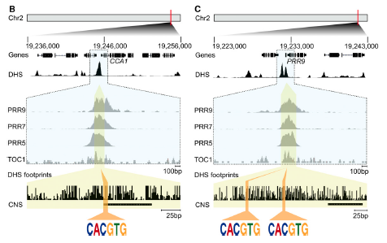
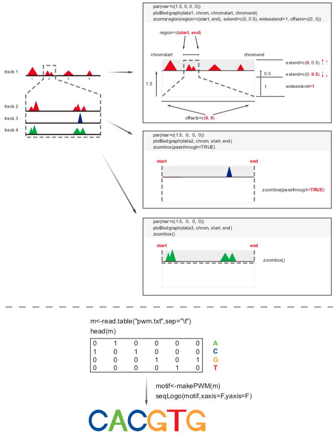
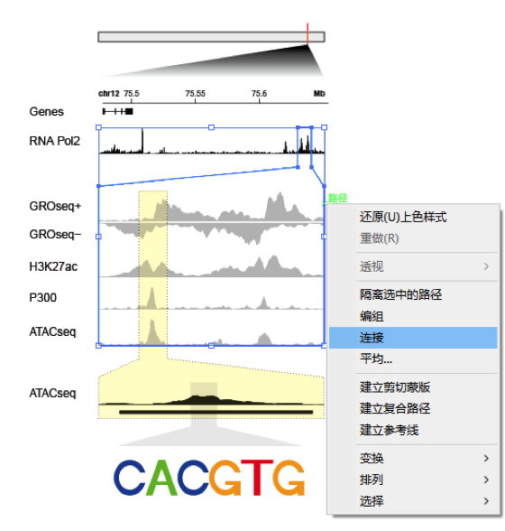
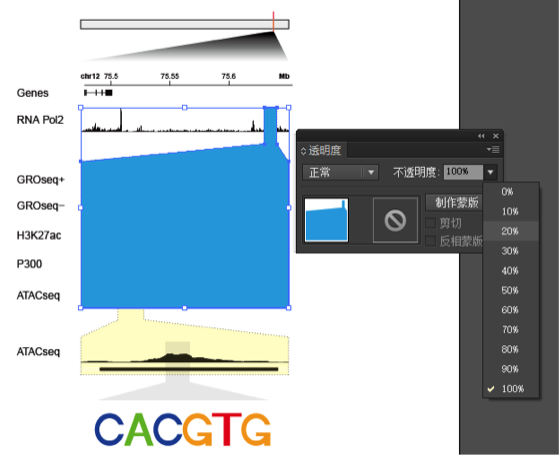
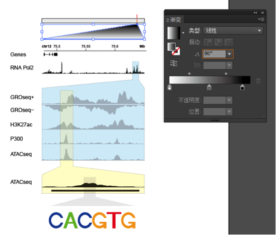

欢迎关注“小丫画图”公众号，同名知识星球等你加入

小丫微信: epigenomics  E-mail: figureya@126.com

作者：启东，“感谢Sushi包作者，我只是把我对这个包的理解跟大家分享而已”

小丫编辑校验

```{r setup, include=FALSE}
knitr::opts_chunk$set(echo = TRUE)
```

## 需求描述

通过在线工具找到了哪个转录因子调控我的基因<https://mp.weixin.qq.com/s/wA6OE-tsD66KPjW6LPs32Q>，不想截屏，想DIY矢量图。用R来画这种类似IGV zoom in效果的信号分布图。



出自<http://www.plantphysiol.org/content/170/1/528.long>

## 应用场景

同时展示某一区域内的ChIP-seq、ATAC-seq、DNase-seq、RNA-seq、GRO-seq等信号。

Sushi包的优点：不限物种，不依赖于任何基因组文件，速度快。

**题外话：**Sushi包非常好用，还可以用来展示ChIA-PET、Hi-C等3D基因组数据，以及GWAS结果画Manhattan图。可参考Sushi文档的5 Appendix举例：<https://www.bioconductor.org/packages/devel/bioc/vignettes/Sushi/inst/doc/Sushi.pdf>

在“小丫画图”公众号回复“IGV”，查看该图在更多paper里的应用。

## 环境设置

使用国内镜像安装包

```r
options("repos"= c(CRAN="https://mirrors.tuna.tsinghua.edu.cn/CRAN/"))
options(BioC_mirror="http://mirrors.ustc.edu.cn/bioc/")
if (!requireNamespace("BiocManager", quietly = TRUE))
    install.packages("BiocManager")
BiocManager::install("Sushi", version = "3.8")
```

加载包

```{r}
library(Sushi)

Sys.setenv(LANGUAGE = "en") #显示英文报错信息
options(stringsAsFactors = FALSE) #禁止chr转成factor
```

## 参数设置

```{r}
chrom <- "chr12"
chromstart <- 75477413 #全局起始位点
chromend <- 75653942 #全局结束位点

#例图zoom in三次，在这里设置放大区域的起止位点
region <- c(75633289,75644072) #zoom in的范围
region2 <- c(75635224,75636574) #进一步zoom in的范围
region3 <- c(75635776,75635931) #再进一步zoom in的范围
```

## 输入文件

Sushi接受输入bedgragh（.bdg）、bedpe、bed、interaction matrix文件。

此处需要bedgragh和bed文件。如果你的数据类型不符，可以用以下方法做转换：

- bam文件，可以用bedtools转成bedgragh、bedpe或bed文件
- gff文件，可以用bedtools转成bed文件
- bw文件，可以到<http://hgdownload.soe.ucsc.edu/admin/exe/linux.x86_64/>下载“bigWigToBedGraph”，转换为.bdg文件；或者用FigureYa3genomeView来画。

ChIP-seq、ATAC-seq、DNase-seq、RNA-seq、GRO-seq的信号用bedgragh文件。

基因结构、peak或motif所在的位置用bed文件。

此处展示了多种测序数据类型，实际操作中根据你需要的类型截取相应的代码来画。

```{r}
a <- read.table("gene_exon.bed",header=TRUE,sep="\t")
head(a)

b <- read.table("ATACseq.bdg",header=FALSE,sep="\t")
head(b)
c <- read.table("H3K27ac.bdg",header=FALSE,sep="\t")
d <- read.table("RNA_Pol2.bdg",header=FALSE,sep="\t")
e <- read.table("GROseq+.bdg",header=FALSE,sep="\t")
f <- read.table("GROseq-.bdg",header=FALSE,sep="\t")
g <- read.table("P300.bdg",header=FALSE,sep="\t")

h <- read.table("ATACseq_peaks.bed",header=FALSE,sep="\t")
head(h)
```

## 画图原理



## 开始画图

大家画图时，请根据实际情况耐心调节layout和每个图的par部分。

```{r}
# Sushi中plotBedgraph函数可以通过range参数控制track的高度；
# 另外也可以通过axis函数为track创建y轴和x轴。
#yheight=3
#plotBedgraph(filename,chrom,chromstart,chromend,range=c(0,yheight),color=trackcol)
#axis(side=2,las=2,tck=-0.05,at=c(0,yheight),labels=c("",yheight))
#axis(side=1,las=2,tck=0,at=c(0,chromend),labels=c("",""))

pdf("Sushiplot.pdf",width=8.5,height=5)
#例图画了9个track，通过layout给每个track留适当的空间
layout(matrix(1:9,9,1), heights=c(1,2,1,1,1,1,2,1,1))
par(mgp=c(3,.3,0))

#1 画基因结构
par(mar=c(0,20,1.5,20)) #bottom, left, top, right
plotGenes(a,chrom,chromstart,chromend,
          labeltext=FALSE,
          bentline=FALSE,bheight=.1,col="black",
          plotgenetype="box",
          maxrows=1)
#画基因组标尺
#sushi没提供画比例尺的功能，如果想要例文那种比例尺，可以每次zoom in都画出这种从头到尾的标尺，然后根据标尺用AI画出比例尺
labelgenome(chrom,chromstart,chromend,
            side=3, #标尺画在上面，或1把标尺画在下面
            n=3, #刻度线的数量
            scale="Mb", #'bp','Kb','Mb'
            line=0, #刻度标签向下移动的距离
            chromcex=0.7,chromadjust=-0.02,scalecex=0.7)
mtext("Genes",side=2,line=7.5,cex=1,font=1,las=2,adj=0,col="black")

#2 画RNA_Pol2的ChIP-seq
par(mar=c(4,20,0,20))
plotBedgraph(d,chrom,chromstart,chromend,
             color="black") #用黑色填充profile
mtext("RNA Pol2",side=2,line=7.5,cex=1,font=1,las=2,adj=0,col="black")
#画被zoom in区域的虚线方框
zoomsregion(region=region,extend=c(0,0.5),wideextend=0.7,offsets=c(0,0),lty=3)

# 第一次zoom in
#3 画GRO-seq的正链，适用于链特异性的RNA-seq数据
par(mar=c(0.2,20,0,20))
plotBedgraph(e,chrom,region[1],region[2],
             color="grey") #用灰色填充profile
mtext("GROseq+",side=2,line=7.5,cex=1,font=1,las=2,adj=0,col="black")
#画zoom in区域的虚线方框
zoombox(passthrough=TRUE,lty=3)
#画被zoom in区域的虚线方框
zoomsregion(region2,extend=c(0,1),wideextend=0,lty=3)

#4 画GRO-seq的负链，适用于链特异性的RNA-seq数据
par(mar=c(1,20,0,20))
plotBedgraph(f,chrom,region[1],region[2],flip=TRUE,color="grey")
mtext("GROseq-",side=2,line=7.5,cex=1,font=1,las=2,adj=0,col="black")
zoombox(passthrough=TRUE,lty=3)
zoomsregion(region2,extend=c(1,1),wideextend=0,lty=3)

#5 画H3K27ac的ChIP-seq
par(mar=c(1,20,0,20))
plotBedgraph(c,chrom,region[1],region[2],color="grey")
mtext("H3K27ac",side=2,line=7.5,cex=1,font=1,las=2,adj=0,col="black")
zoombox(passthrough=TRUE,lty=3)
zoomsregion(region2,extend=c(1,1),wideextend=0,lty=3)

#6 画P300的ChIP-seq
par(mar=c(1,20,0,20))
plotBedgraph(g,chrom,region[1],region[2],color="grey")
mtext("P300",side=2,line=7.5,cex=1,font=1,las=2,adj=0,col="black")
zoombox(passthrough=TRUE,lty=3)
zoomsregion(region2,extend=c(1,1),wideextend=0,lty=3)

#7 画ATACseq
par(mar=c(4,20,0,20))
plotBedgraph(b,chrom,region[1],region[2],color="grey")
mtext("ATACseq",side=2,line=7.5,cex=1,font=1,las=2,adj=0,col="black")
zoombox(lty=3)
zoomsregion(region2,extend=c(1,0.5),wideextend=0.7,offsets=c(0,0),lty=3)

# 第二次zoom in
#8 画ATACseq
par(mar=c(1,20,0,20))
plotBedgraph(b,chrom,region2[1],region2[2],range=c(0,0.5),color="black")
mtext("ATACseq",side=2,line=7.5,cex=1,font=1,las=2,adj=0,col="black")
zoombox(passthrough=TRUE,lty=3,topextend = 1)
zoomsregion(region3,extend=c(0,1),wideextend=0,lty=1,zoomborder=rgb(0,0,0,20,maxColorValue=255),col=rgb(0,0,0,20,maxColorValue=255))

#9 画ATACseq的峰，同样适用于motif位置的展示
par(mar=c(3,20,0,20))
plotBed(beddata=h,chrom=chrom,region2[1],region2[2],row=1,color="black")
mtext("",side=2,line=7.5,cex=1,font=1,las=2,adj=0,col="black")
zoombox(lty=3)

# 画第三次zoom in的框
zoomsregion(region3,extend=c(1,2),wideextend=4,offsets=c(0,0),lty=3,zoomborder=rgb(0,0,0,20,maxColorValue=255),col=rgb(0,0,0,20,maxColorValue=255))
#后面用AI加上motif
dev.off()
```


## 附：后期加工

输出的pdf文件是矢量图，可以用Illustrator等软件编辑。例如加入染色体全局图和motif logo等等。

### AI中添加底色的方法

1. 先用“直线段工具”描边，然后右键选连接。



2. 为连接好的框填充颜色，边框颜色选无，将不透明度调至适当值，如20%。然后可以对这个“底色”右键选择放到底层。



3. 用“矩形工具”画出染色体并调整边框和填充颜色；用“直线段工具”在染色体对应位置竖直画一条红线；从该红线出发用“直线段工具”画一个三角形，三角形端点与track左右端点对齐，连接三角形填充黑色，最后选择渐变功能调整渐变角度为90°后就愉快地拖动渐变条吧！



### 根据矩阵生成motif logo的方法见SeqLogo文件夹

在“小丫画图”公众号回复“motif”，查看motif矩阵的查询方法

### 编辑后的效果：


```{r}
sessionInfo()
```